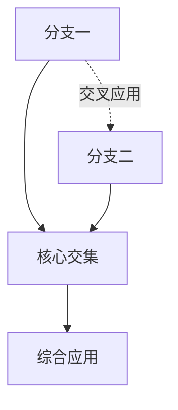
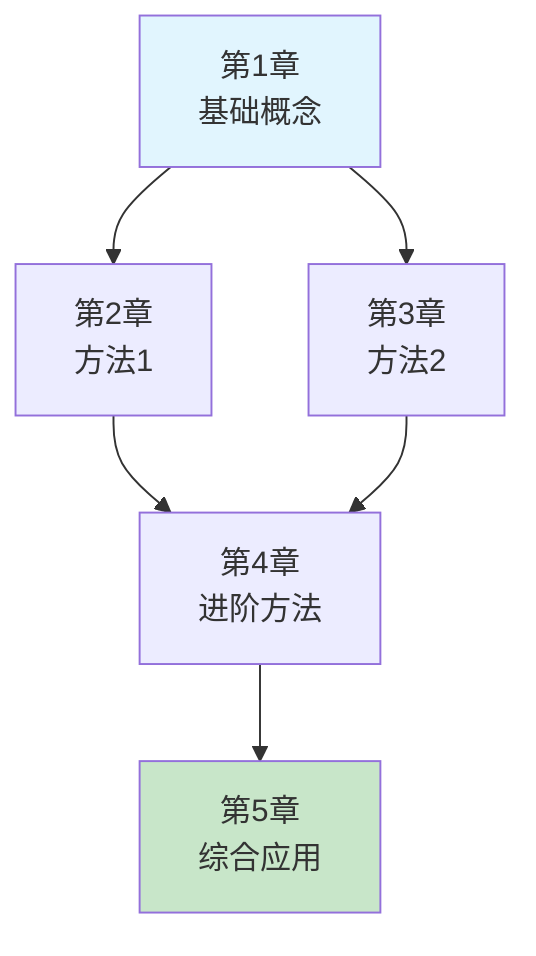

# {书籍名称}

> 本书总览 | Deep Dive 学习材料
> 生成时间: {timestamp}

---

## 1. 序言

### 1.1 学科背景

{该学科在科学/工程/社会中的地位和重要性。2000+ 字符的详细描述}

- **学科定位**: {该学科属于哪个大领域，与其他学科的关系}
- **研究对象**: {该学科研究什么问题}
- **理论基础**: {该学科建立在哪些基础理论之上}

### 1.2 核心思想

{本书的核心理念和学习本学科的关键思维方式}

- **基本假设**: {学科的基本假设或公理}
- **方法论**: {该学科特有的研究方法}
- **思维特点**: {学习本学科需要培养的思维模式}

### 1.3 主要内容

{本书涵盖的主题概览，各章节的组织逻辑}

本书共分为 **{N}** 章，涵盖以下核心主题：

1. **{主题1}**: {简要描述}
2. **{主题2}**: {简要描述}
3. **...**

### 1.4 应用价值

{学习本书的实际意义，能解决的问题}

- **理论价值**: {对理论体系建设的贡献}
- **实践价值**: {在实际工作中的应用场景}
- **交叉价值**: {与其他学科结合的潜力}

---

## 2. 主要分支

{根据各章节内容，归纳学科的主要分支。3000+ 字符}

### 2.1 分支一: {分支名称}

**定义**: {该分支的定义}

**核心内容**:
- {要点1}
- {要点2}
- {要点3}

**与本书的关联**: {本书哪些章节涵盖此分支}

### 2.2 分支二: {分支名称}

**定义**: {该分支的定义}

**核心内容**:
- {要点1}
- {要点2}
- {要点3}

**与本书的关联**: {本书哪些章节涵盖此分支}

### 2.3 分支间的关系



---

## 3. 历史发展

{学科的历史演进。3000+ 字符}

### 3.1 早期发展 (时期)

**关键人物与事件**:

| 年份 | 人物 | 贡献 |
|------|------|------|
| {年份} | {人物} | {贡献描述} |
| {年份} | {人物} | {贡献描述} |

**奠基性工作**: {该时期奠定学科基础的关键工作}

### 3.2 现代发展 (时期)

**关键突破**:

| 年份 | 突破 | 意义 |
|------|------|------|
| {年份} | {突破描述} | {对学科的影响} |

**理论完善**: {该时期理论体系如何完善}

### 3.3 当代进展 ({当前年份-20} 至今)

**当前趋势**:
- {趋势1: 如计算能力的提升带来的影响}
- {趋势2: 如与其他学科的交叉}
- {趋势3: 如新的应用场景}

**最新突破**: {近年的重要进展}

---

## 4. 核心概念

{全书核心概念的系统性总结。5000+ 字符，带 LaTeX 公式}

### 4.1 基础定义

#### {概念一}

**定义**: 
> {正式定义陈述}

**数学表达**:
$$\text{LaTeX 公式}$$

**直观理解**: {通俗易懂的解释}

**相关概念**: {链接到相关概念}

#### {概念二}

**定义**: 
> {正式定义陈述}

**数学表达**:
$$\text{LaTeX 公式}$$

### 4.2 重要定理

#### 定理: {定理名称}

**陈述**: 
> {定理的正式陈述}

**条件**:
- 条件1: {...}
- 条件2: {...}

**结论**:
$$\text{数学表达式}$$

**证明要点**: {证明的核心思路，详见第{X}章}

**应用**: {该定理的典型应用场景}

### 4.3 核心算法/方法

#### {算法/方法名称}

**输入**: {算法需要的输入}

**输出**: {算法产生的输出}

**步骤**:
1. {步骤1}
2. {步骤2}
3. {...}

**复杂度**: {时间/空间复杂度分析}

**适用条件**: {何时使用该算法}

---

## 5. 应用

{书中理论的实际应用。3000+ 字符}

### 5.1 应用领域概览

```mermaid
mindmap
  root((应用领域))
    {领域1}
      {子领域1}
      {子领域2}
    {领域2}
      {子领域1}
      {子领域2}
    {领域3}
```

### 5.2 典型案例

#### 案例一: {案例名称}

**背景**: {案例的背景描述}

**问题**: {需要解决的具体问题}

**解决方案**: {如何应用本书理论解决问题}

**效果**: {取得的成果}

#### 案例二: {案例名称}

**背景**: {案例的背景描述}

**问题**: {需要解决的具体问题}

**解决方案**: {如何应用本书理论解决问题}

### 5.3 实践价值总结

| 应用场景 | 本书理论 | 实际效果 |
|----------|----------|----------|
| {场景} | {理论/方法} | {效果} |

---

## 6. 现代研究

{当前研究前沿和开放问题。3000+ 字符}

### 6.1 当前研究前沿

#### 方向一: {研究方向}

**研究内容**: {该方向的研究焦点}

**代表性工作**:
- {论文/工作1}
- {论文/工作2}

**挑战**: {该方向面临的主要挑战}

#### 方向二: {研究方向}

{同上结构}

### 6.2 开放问题

{该领域尚未解决的重要问题}

1. **{问题1}**: {问题描述}
   - **难点**: {为什么难以解决}
   - **进展**: {当前的研究进展}

2. **{问题2}**: {问题描述}
   - **难点**: {为什么难以解决}
   - **进展**: {当前的研究进展}

### 6.3 发展方向

{未来可能的发展趋势}

- **短期** (1-3年): {近期可能取得的进展}
- **中期** (3-5年): {中期发展方向}
- **长期** (5年以上): {长远的发展愿景}

---

## 7. 学习路线图

### 7.1 前置知识

学习本书之前建议掌握：

| 知识领域 | 掌握程度 | 相关章节 |
|----------|----------|----------|
| {知识1} | 必须掌握 | 第{X}章依赖 |
| {知识2} | 了解即可 | 辅助理解 |

### 7.2 章节依赖关系



### 7.3 学习路径建议

**路径一: 理论导向**
```
第1章 → 第2章 → 第4章 → 第5章 → 第3章
```
**适合**: {适合人群}

**路径二: 应用导向**
```
第1章 → 第3章 → 第5章 → 第2章 → 第4章
```
**适合**: {适合人群}

---

## 8. 章节导航

| 章节 | 标题 | 核心内容 | 难度 | 建议时间 | 前置章节 |
|:----:|------|----------|:----:|:--------:|----------|
| 1 | {标题} | {核心内容} | ⭐⭐ | 3h | 无 |
| 2 | {标题} | {核心内容} | ⭐⭐⭐ | 4h | 第1章 |
| 3 | {标题} | {核心内容} | ⭐⭐⭐⭐ | 5h | 第1章 |
| ... | ... | ... | ... | ... | ... |

**难度说明**:
- ⭐: 入门，易于理解
- ⭐⭐: 基础，需要一定思考
- ⭐⭐⭐: 中等，需要认真钻研
- ⭐⭐⭐⭐: 困难，需要深入理解
- ⭐⭐⭐⭐⭐: 专家级，极具挑战性

---

## 9. 公式速查

### 9.1 按章节汇总

| 公式 | 名称 | 章节 | 用途 |
|------|------|:----:|------|
| $...$ | {公式名称} | 第{X}章 | {何时使用} |
| $$...$$ | {公式名称} | 第{X}章 | {何时使用} |

### 9.2 常用公式分类

#### {类别一}

**公式名称**: 
$$\text{LaTeX 公式}$$

**解释**: {公式的含义}

#### {类别二}

**公式名称**: 
$$\text{LaTeX 公式}$$

**解释**: {公式的含义}

---

## 10. 术语索引

### 10.1 按字母/拼音排序

| 术语 | 英文 | 定义 | 出现章节 |
|------|------|------|:--------:|
| {术语} | {English} | {简要定义} | 第{X}章 |

### 10.2 缩写对照

| 缩写 | 全称 | 中文 | 首次出现 |
|------|------|------|:--------:|
| {缩写} | {Full Name} | {中文} | 第{X}章 |

---

## 11. 参考文献

### 11.1 教材与专著

1. {作者}. {书名}[M]. {出版社}, {年份}.
2. ...

### 11.2 经典论文

1. {作者}. {论文标题}[J]. {期刊名}, {年份}, {卷(期)}: {页码}.
2. ...

### 11.3 在线资源

1. {资源名称}: {URL}
2. ...

### 11.4 延伸阅读

**理论基础**:
- {书籍/论文1}
- {书籍/论文2}

**应用方向**:
- {书籍/论文1}
- {书籍/论文2}

---

## 12. 附录

### 12.1 符号说明

| 符号 | 含义 | 首次出现 |
|------|------|:--------:|
| $...$ | {含义} | 第{X}章 |

### 12.2 记号约定

本书中使用的记号约定：

- {约定1}: {说明}
- {约定2}: {说明}

### 12.3 版本历史

| 版本 | 日期 | 更新内容 |
|:----:|------|----------|
| v1.0 | {日期} | 初始版本 |

---

> 📌 **提示**: 本文档是 Deep Dive 学习材料的入口，建议从 [导航](导航.md) 开始，按章节顺序学习。
