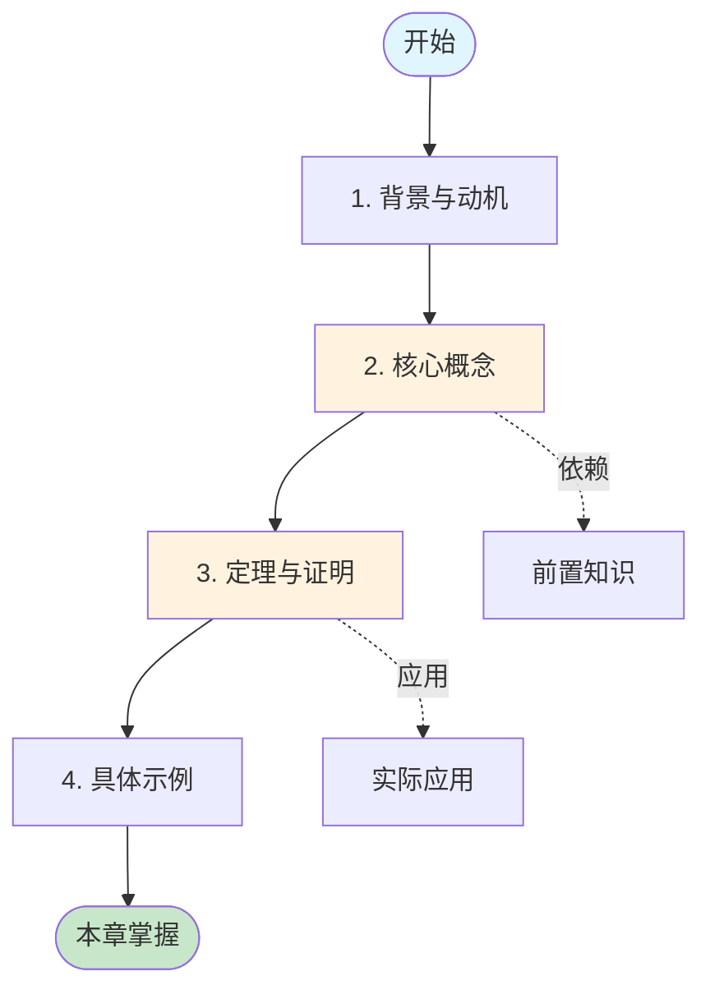
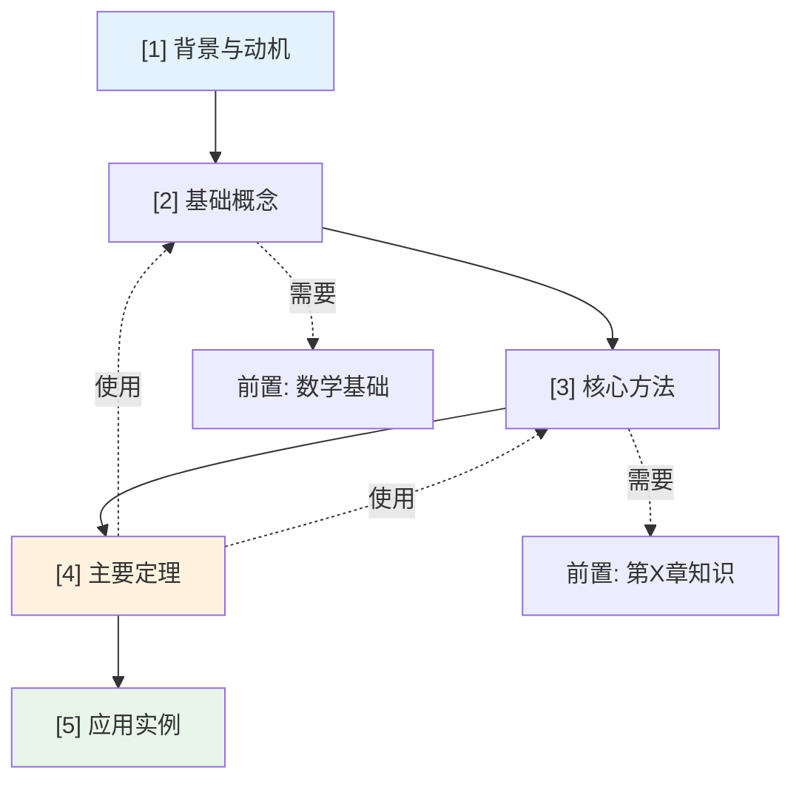

# 第 {n} 章：{Chapter Title}

> 📚 章节概览 | Deep Dive 学习导航
> ⏱️ 建议学习时间: {X} 小时 | 🎯 难度: {⭐⭐⭐}

---

## 学习目标

学完本章后，你将能够：

- [ ] **理解**: {目标 1 - 描述需要理解的核心概念}
- [ ] **掌握**: {目标 2 - 描述需要掌握的定理或方法}
- [ ] **应用**: {目标 3 - 描述能够解决的实际问题}
- [ ] **分析**: {目标 4 - 描述能够进行的分析能力}
- [ ] **评估**: {目标 5 - 描述能够做出的判断或评估}

---

## 本章速览

### 核心问题
> {用一句话概括本章要解决的核心问题}

### 关键思想
> {用一段话描述本章的核心思想或方法论}

### 本章地图



---

## 难度预警

### 🔴 关键节（需重点攻克）

| 节号 | 标题 | 难度 | 预计时间 | 关键挑战 |
|:----:|------|:----:|:--------:|----------|
| {n.m} | {节标题} | ⭐⭐⭐⭐ | {X}h | {挑战描述} |
| {n.m} | {节标题} | ⭐⭐⭐⭐⭐ | {X}h | {挑战描述} |

**攻克建议**: {如何有效学习这些难点}

### 🟡 具有挑战性的证明

| 定理 | 位置 | 难度 | 技巧 |
|------|:----:|:----:|------|
| {定理名} | {n.m} | ⭐⭐⭐⭐ | {证明关键技巧} |

### 🟢 复习巩固节

| 节号 | 标题 | 内容 | 作用 |
|:----:|------|------|------|
| {n.m} | {节标题} | {内容简述} | 巩固/过渡/应用 |

---

## 前置知识检查

学习本章前，请确保已掌握：

| 知识项 | 来源 | 重要程度 | 自检问题 |
|--------|------|:--------:|----------|
| {知识1} | 第{X}章 | 🔴 必须 | {问题} |
| {知识2} | 第{X}章 | 🟡 建议 | {问题} |
| {知识3} | 外部 | 🟢 可选 | {问题} |

**前置知识速查**: [快速回顾](#前置知识回顾)

---

## 节依赖图



**依赖说明**:
- **实线**: 必须的前序内容
- **虚线**: 需要的前置知识
- **红色高亮**: 关键路径（不可跳过）

---

## 定理/结果检查清单

| 编号 | 名称 | 类型 | 关键用途 | 位置 | 掌握状态 |
|:----:|------|:----:|----------|:----:|:--------:|
| {n.1} | {定理名} | 定理 | {用途} | {n.m} | [ ] |
| {n.2} | {引理名} | 引理 | {用途} | {n.m} | [ ] |
| {n.3} | {推论名} | 推论 | {用途} | {n.m} | [ ] |
| {n.4} | {算法名} | 算法 | {用途} | {n.m} | [ ] |

**证明掌握度自查**:
- [ ] 能独立复述 {定理n.1} 的证明
- [ ] 能解释 {定理n.2} 证明的关键步骤
- [ ] 能说明 {算法n.4} 的正确性

---

## 关键公式预览

本章将涉及的核心公式：

| 公式 | 名称 | 用途 | 位置 |
|------|------|------|:----:|
| $...$ | {公式名} | {用途} | {n.m} |
| $$...$$ | {公式名} | {用途} | {n.m} |

**公式关系图**:
```
[公式 A] --推导--> [公式 B] --组合--> [核心定理]
     |                                |
     v                                v
[公式 C] ----------------------> [应用结果]
```

---

## 学习建议

### 📖 推荐学习顺序

```
第一次: 快速浏览 → 理解框架 → 标记难点
    ↓
第二次: 精读概念 → 推导公式 → 理解证明
    ↓
第三次: 动手实践 → 完成示例 → 总结提炼
```

### ⏰ 时间规划

| 阶段 | 内容 | 时间 | 产出 |
|------|------|:----:|------|
| 预习 | 读概览、查前置 | 20min | 问题清单 |
| 学习 | 精读各节 | {X}h | 笔记 |
| 练习 | 做示例、推导 | {X}h | 练习本 |
| 复习 | 总结、自查 | 30min | 知识卡片 |
| **总计** | | **{X}h** | |

### 🎯 重点突破策略

**对于 🔴 关键节**:
1. {策略1}
2. {策略2}
3. {策略3}

**对于 🟡 难证明**:
1. {策略1}
2. {策略2}

### 📝 推荐笔记方式

- **概念卡**: 术语定义 + 公式 + 例子
- **证明图**: 证明步骤的思维导图
- **错题本**: 常见错误 + 正确理解
- **联系图**: 本章与前后章的联系

---

## 自测问题

### 入门自检（学习前）

1. {检验前置知识的问题}?
2. {引导思考的问题}?
3. {预测内容的问题}?

### 进度自检（学习中）

每学完一节，问自己：
- [ ] 这一节的核心是什么？
- [ ] 能否用自己的话解释关键概念？
- [ ] 能否推导/复述关键证明？

### 掌握度测试（学习后）

1. **概念题**: {概念问题}?
2. **计算题**: {计算问题}?
3. **证明题**: {证明问题}?
4. **应用题**: {应用问题}?

---

## 常见困难点预警

### ⚠️ 容易混淆的概念

| 概念 A | 概念 B | 关键区别 | 记忆技巧 |
|--------|--------|----------|----------|
| {A} | {B} | {区别} | {技巧} |

### ⚠️ 常见的错误理解

| 错误想法 | 正确理解 | 说明 |
|----------|----------|------|
| ❌ {错误} | ✅ {正确} | {解释} |

### ⚠️ 计算/推导易错点

- **易错点 1**: {描述} → {避免方法}
- **易错点 2**: {描述} → {避免方法}

---

## 与其他章节的联系

### 前置依赖

| 章节 | 依赖内容 | 在本章的用途 |
|------|----------|--------------|
| 第{X}章 | {内容} | {用途} |

### 为后续章节铺垫

| 章节 | 本章内容的作用 |
|------|----------------|
| 第{X}章 | {本章内容如何为后续章节服务} |

### 平行关联

- **第{X}章**: {与本章内容相关的平行主题}
- **第{X}章**: {与本章方法对比的章节}

---

## 延伸阅读与资源

### 本章参考资料

| 类型 | 资源 | 说明 | 阅读建议 |
|------|------|------|----------|
| 论文 | {论文} | {说明} | {建议} |
| 书籍 | {章节/书} | {说明} | {建议} |
| 视频 | {资源} | {说明} | {建议} |

### 辅助学习工具

- **可视化工具**: {工具名} - {用途}
- **计算工具**: {工具名} - {用途}
- **练习资源**: {资源} - {用途}

---

## 快速参考卡片

### 本章一页纸总结

```
┌─────────────────────────────────────────────────────────────┐
│  第 {n} 章: {标题}                                          │
├─────────────────────────────────────────────────────────────┤
│  核心概念: {概念1}, {概念2}, {概念3}                        │
│  关键定理: {定理1}, {定理2}                                 │
│  主要方法: {方法}                                           │
│  典型应用: {应用}                                           │
├─────────────────────────────────────────────────────────────┤
│  关键公式:                                                  │
│  • {公式1}                                                  │
│  • {公式2}                                                  │
├─────────────────────────────────────────────────────────────┤
│  常见错误:                                                  │
│  ✗ {错误1} → ✓ {正确1}                                      │
│  ✗ {错误2} → ✓ {正确2}                                      │
└─────────────────────────────────────────────────────────────┘
```

---

## 学习检查清单

### 学习前
- [ ] 已阅读本章概览
- [ ] 已检查前置知识
- [ ] 已准备学习材料

### 学习中
- [ ] 完成 {n.1} 节学习
- [ ] 完成 {n.2} 节学习
- [ ] 完成 {n.3} 节学习
- [ ] ...

### 学习后
- [ ] 完成所有自测问题
- [ ] 能复述核心证明
- [ ] 能独立完成示例
- [ ] 已阅读总结回顾
- [ ] 已记录疑难点

---

## 前置知识回顾

> 本节提供学习本章所需前置知识的快速回顾

### {前置知识 1}

**要点**: {核心要点}

**公式**: $$...$$

**例子**: {简单例子}

### {前置知识 2}

**要点**: {核心要点}

**与本章的联系**: {如何在本章中使用}

---

> 🎯 **下一步**: 准备好后，点击导航进入 [第{n.m}节]({n.m}_{节名}.md) 开始学习！
