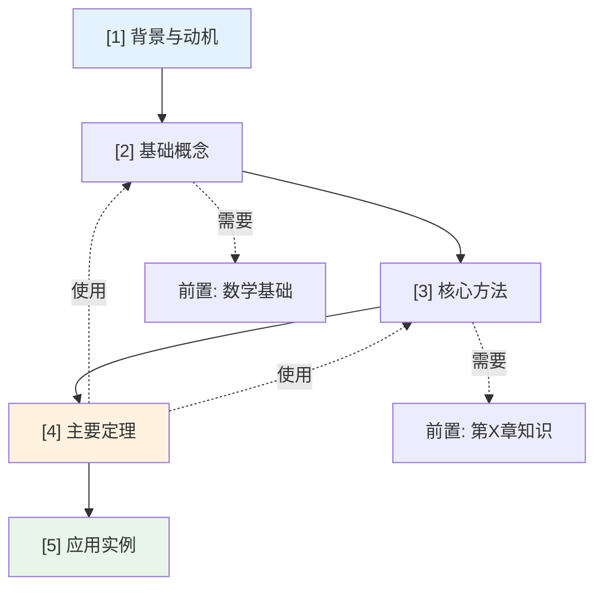

# 第 {n} 章：{Chapter Title} - 概览与总结

> 📚 章节概览 | Deep Dive 学习导航 | 📝 本章复习指南
> ⏱️ 建议学习时间: {X} 小时 | 🎯 难度: {⭐⭐⭐}

---

## 一、学习目标

学完本章后，你将能够：

- [ ] **理解**: {目标 1 - 描述需要理解的核心概念}
- [ ] **掌握**: {目标 2 - 描述需要掌握的定理或方法}
- [ ] **应用**: {目标 3 - 描述能够解决的实际问题}
- [ ] **分析**: {目标 4 - 描述能够进行的分析能力}
- [ ] **评估**: {目标 5 - 描述能够做出的判断或评估}

---

## 二、本章导览

### 2.1 核心问题与关键思想

**核心问题**
> {用一句话概括本章要解决的核心问题}

**关键思想**
> {用一段话描述本章的核心思想或方法论}

### 2.2 本章地图


### 2.3 难度预警

| 类型 | 节号 | 标题 | 难度 | 预计时间 | 关键挑战 |
|:----:|:----:|------|:----:|:--------:|----------|
| 🔴 关键节 | {n.m} | {节标题} | ⭐⭐⭐⭐ | {X}h | {挑战描述} |
| 🟡 难证明 | {定理名} | {n.m} | ⭐⭐⭐⭐ | - | {证明关键技巧} |
| 🟢 巩固节 | {n.m} | {节标题} | ⭐⭐ | {X}h | {内容简述} |

**攻克建议**: {如何有效学习这些难点}

### 2.4 学习建议

**推荐学习顺序**
```
第一次: 快速浏览 → 理解框架 → 标记难点
    ↓
第二次: 精读概念 → 推导公式 → 理解证明
    ↓
第三次: 动手实践 → 完成示例 → 总结提炼
```

**时间规划**

| 阶段 | 内容 | 时间 | 产出 |
|------|------|:----:|------|
| 预习 | 读概览、查前置 | 20min | 问题清单 |
| 学习 | 精读各节 | {X}h | 笔记 |
| 练习 | 做示例、推导 | {X}h | 练习本 |
| 复习 | 总结、自查 | 30min | 知识卡片 |
| **总计** | | **{X}h** | |

---

## 三、学习准备

### 3.1 前置知识检查

| 知识项 | 来源 | 重要程度 | 自检问题 |
|--------|------|:--------:|----------|
| {知识1} | 第{X}章 | 🔴 必须 | {问题} |
| {知识2} | 第{X}章 | 🟡 建议 | {问题} |
| {知识3} | 外部 | 🟢 可选 | {问题} |

### 3.2 节依赖图



**依赖说明**: 实线=必须前序 | 虚线=前置知识 | 红色高亮=关键路径

### 3.3 定理/结果检查清单

| 编号 | 名称 | 类型 | 关键用途 | 位置 | 掌握状态 |
|:----:|------|:----:|----------|:----:|:--------:|
| {n.1} | {定理名} | 定理 | {用途} | {n.m} | [ ] |
| {n.2} | {引理名} | 引理 | {用途} | {n.m} | [ ] |
| {n.3} | {推论名} | 推论 | {用途} | {n.m} | [ ] |
| {n.4} | {算法名} | 算法 | {用途} | {n.m} | [ ] |

---

## 四、知识梳理

### 4.1 核心逻辑线索

{用 3-5 段连贯的叙述，将所有节连接成完整的故事线}

本章围绕**{核心问题}**展开，从**{起点/背景}**出发，逐步深入到**{核心内容}**。首先，我们介绍了**{第1节核心内容}**，这为理解后续内容奠定了基础。接着，在**{第2节}**中，我们建立了**{关键概念/方法}**，这一部分是本章的理论核心。

{中间部分的逻辑发展...}

最终，通过**{最后一节}**，我们将理论应用于**{实际场景}**，完成了从理论到实践的闭环。

**知识发展时间线**
```
[背景与动机] → [基础概念建立] → [理论发展] → [核心定理] → [应用实践]
      ↓              ↓               ↓            ↓            ↓
   为什么        是什么           如何推导       核心结论      怎么用
   研究？        概念？           证明？         是什么？       解决问题？
```

### 4.2 核心要点速查

**一句话总结每节**

| 节号 | 标题 | 一句话总结 |
|:----:|------|------------|
| {n.1} | {标题} | {核心内容的一句话概括} |
| {n.2} | {标题} | {核心内容的一句话概括} |
| {n.3} | {标题} | {核心内容的一句话概括} |
| {n.4} | {标题} | {核心内容的一句话概括} |

**必背要点（3-5 条）**

1. **{要点一标题}**: {详细说明，包含关键公式或结论}
2. **{要点二标题}**: {详细说明}
3. **{要点三标题}**: {详细说明}
4. **{要点四标题}**: {详细说明}
5. **{要点五标题}**: {详细说明}

**核心公式卡片**

| 公式 | 名称 | 使用条件 | 记忆要点 |
|------|------|----------|----------|
| $$...$$ | {名称} | {何时使用} | {记忆技巧} |
| $...$ | {名称} | {何时使用} | {记忆技巧} |

### 4.3 概念对比表

**相似概念辨析**

| 概念 A | 概念 B | 相似点 | 关键差异 | 适用场景 |
|--------|--------|--------|----------|----------|
| {A} | {B} | {共同点} | **本质**: ...<br>**形式**: ... | A: {场景}<br>B: {场景} |
| {C} | {D} | {共同点} | **本质**: ...<br>**计算**: ... | C: {场景}<br>D: {场景} |

**方法/算法对比**

| 方法 | 核心思想 | 优点 | 缺点 | 适用条件 |
|------|----------|------|------|----------|
| {方法A} | {思想} | ✅ {优点} | ❌ {缺点} | {条件} |
| {方法B} | {思想} | ✅ {优点} | ❌ {缺点} | {条件} |

### 4.4 定理依赖图

**完整依赖关系**

```mermaid
graph TD
    A[Lemma {n}.1<br/>{引理名}] --> C[Theorem {n}.1<br/>{定理名}]
    B[Lemma {n}.2<br/>{引理名}] --> C
    C --> D[Corollary {n}.1<br/>{推论名}]
    C --> E[Theorem {n}.2<br/>{定理名}]
    F[前置知识<br/>第{X}章] --> A
    F --> B

    style C fill:#fff3e0
    style E fill:#fff3e0
```

**证明路径分析**

| 目标定理 | 直接依赖 | 间接依赖 | 证明策略 |
|----------|----------|----------|----------|
| {定理n.1} | {引理n.1}, {引理n.2} | {前置知识} | {策略简述} |
| {定理n.2} | {定理n.1} | {引理n.1}, {引理n.2} | {策略简述} |

**关键证明技巧总结**

| 技巧 | 应用定理 | 核心思想 | 可迁移性 |
|------|----------|----------|----------|
| {技巧1} | {定理} | {思想} | ⭐⭐⭐⭐⭐ |
| {技巧2} | {定理} | {思想} | ⭐⭐⭐⭐ |

---

## 五、检验与反思

### 5.1 本章测验

**快速自测（5分钟）**

**Q1**: {概念性问题}?
<details>
<summary>答案</summary>
{答案}
</details>

**Q2**: {计算性问题}?
<details>
<summary>答案</summary>
{答案}
</details>

**Q3**: {理解性问题}?
<details>
<summary>答案</summary>
{答案}
</details>

**深度思考题**

1. {需要深入思考的问题1}?
2. {需要深入思考的问题2}?
3. {需要深入思考的问题3}?

### 5.2 常见误解澄清

| 常见误解 ❌ | 正确理解 ✅ | 误解来源 | 纠正方法 |
|-------------|-------------|----------|----------|
| {错误想法1} | {正确理解1} | {为什么会误解} | {如何纠正} |
| {错误想法2} | {正确理解2} | {为什么会误解} | {如何纠正} |
| {错误想法3} | {正确理解3} | {为什么会误解} | {如何纠正} |

**易错点提醒**

1. **{错误类型1}**: {具体描述}
   - ❌ 错误做法: {展示}
   - ✅ 正确做法: {展示}
   - 💡 避免技巧: {技巧}

2. **{错误类型2}**: {具体描述}
   - ❌ 错误做法: {展示}
   - ✅ 正确做法: {展示}

### 5.3 学习反思

**掌握度自评**

| 评估项 | 完全掌握 | 基本理解 | 需要复习 | 完全不懂 |
|--------|:--------:|:--------:|:--------:|:--------:|
| {知识点1} | ⭕ | 🔶 | 🔷 | ❌ |
| {知识点2} | ⭕ | 🔶 | 🔷 | ❌ |
| {定理证明} | ⭕ | 🔶 | 🔷 | ❌ |
| {应用问题} | ⭕ | 🔶 | 🔷 | ❌ |

**图例**: ⭕ 完全掌握 | 🔶 基本理解 | 🔷 需要复习 | ❌ 完全不懂

**疑难点记录**

| 序号 | 问题描述 | 严重程度 | 解决状态 | 备注 |
|:----:|----------|:--------:|:--------:|------|
| 1 | {问题} | 🔴/🟡/🟢 | 未解决/已解决 | {备注} |

---

## 六、复习工具

### 6.1 一页纸总结

**第 {n} 章: {标题}**

- **核心概念**
  - {概念1}: {一句话定义}
  - {概念2}: {一句话定义}

- **关键定理**
  - {定理1}: {核心结论}
  - {定理2}: {核心结论}

- **重要公式**
  1. {公式} → {用途}
  2. {公式} → {用途}

- **常见陷阱**
  - ✗ {错误1} → ✓ {正确1}
  - ✗ {错误2} → ✓ {正确2}

### 6.2 考前速记清单

**必须记住的（10条）**:
1. {条目1}
2. {条目2}
3. ...

**能够推导的（5条）**:
1. {条目1}
2. {条目2}
3. ...

---

## 七、拓展与衔接

### 7.1 知识图谱

**本章在全书中的位置**

```mermaid
flowchart TB
    subgraph 前置基础
        P1[第{X}章<br/>{主题}]
        P2[第{X}章<br/>{主题}]
    end

    subgraph 本章核心
        C1[第{n}章<br/>{本章主题}]
    end

    subgraph 后续发展
        N1[第{X}章<br/>{主题}]
        N2[第{X}章<br/>{主题}]
    end

    P1 --> C1
    P2 --> C1
    C1 --> N1
    C1 --> N2

    style C1 fill:#fff3e0
```

**跨章节联系**

| 本章内容 | 前置章节 | 后续章节 | 横向关联 |
|----------|----------|----------|----------|
| {内容1} | 第{X}章 {知识点} | 第{X}章 {应用} | 第{X}章 {对比} |
| {内容2} | 第{X}章 {知识点} | 第{X}章 {应用} | - |

### 7.2 扩展阅读

**理论深化**

| 资源 | 类型 | 难度 | 说明 | 阅读建议 |
|------|------|:----:|------|----------|
| {论文/书籍} | {类型} | ⭐⭐⭐⭐ | {说明} | {建议} |

**应用拓展**

| 应用领域 | 典型问题 | 本章理论的应用 | 延伸阅读 |
|----------|----------|----------------|----------|
| {领域} | {问题} | {如何应用} | {资源} |

### 7.3 下一步行动

**复习计划建议**

| 场景 | 步骤 | 时间 |
|------|------|:----:|
| **考前复习** | 核心要点 → 本章测验 → 常见误解 → 复习卡 | 45min |
| **查漏补缺** | 查看疑难点 → 重读相关节 → 做练习题 | 灵活 |

**与后续章节衔接**

学习下一章前，请确保：
- [ ] 本章核心定理能够复述
- [ ] 基本例题能够独立完成
- [ ] 没有未解决的严重疑问

**进入第 {n+1} 章**: [点击继续 →](../第{n+1}章_{标题}/00_概览.md)

---

> 🎉 **恭喜完成第 {n} 章的学习！**
>
> 回顾是巩固知识的最佳方式。如果某些部分仍感到模糊，不要犹豫，回到对应小节再读一遍。
>
> 🎯 **下一步**: [习题与解答 →](习题与解答.md) | [返回导航 →](../导航.md)
