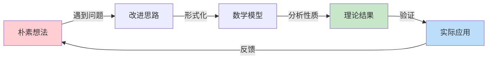

# 第 {n} 章 总结与回顾

> 📝 本章复习指南 | 查漏补缺 | 巩固提升
> 建议用时: 30-45 分钟

---

## 1. 核心逻辑线索

### 1.1 本章叙事脉络

{用 3-5 段连贯的叙述，将所有节连接成完整的故事线：}

本章围绕**{核心问题}**展开，从**{起点/背景}**出发，逐步深入到**{核心内容}**。首先，我们介绍了**{第1节核心内容}**，这为理解后续内容奠定了基础。接着，在**{第2节}**中，我们建立了**{关键概念/方法}**，这一部分是本章的理论核心。

{中间部分的逻辑发展...}

最终，通过**{最后一节}**，我们将理论应用于**{实际场景}**，完成了从理论到实践的闭环。

### 1.2 知识发展时间线

```
[背景与动机] → [基础概念建立] → [理论发展] → [核心定理] → [应用实践]
      ↓              ↓               ↓            ↓            ↓
   为什么        是什么           如何推导       核心结论      怎么用
   研究？        概念？           证明？         是什么？       解决问题？
```

### 1.3 思想演进图



---

## 2. 核心要点速查

### 2.1 一句话总结每节

| 节号 | 标题 | 一句话总结 |
|:----:|------|------------|
| {n.1} | {标题} | {核心内容的一句话概括} |
| {n.2} | {标题} | {核心内容的一句话概括} |
| {n.3} | {标题} | {核心内容的一句话概括} |
| {n.4} | {标题} | {核心内容的一句话概括} |

### 2.2 必背要点（3-5 条）

1. **{要点一标题}**: {详细说明，包含关键公式或结论}

2. **{要点二标题}**: {详细说明}

3. **{要点三标题}**: {详细说明}

4. **{要点四标题}**: {详细说明}

5. **{要点五标题}**: {详细说明}

### 2.3 核心公式卡片

| 公式 | 名称 | 使用条件 | 记忆要点 |
|------|------|----------|----------|
| $$...$$ | {名称} | {何时使用} | {记忆技巧} |
| $...$ | {名称} | {何时使用} | {记忆技巧} |

---

## 3. 概念对比表

### 3.1 相似概念辨析

| 概念 A | 概念 B | 相似点 | 关键差异 | 适用场景 |
|--------|--------|--------|----------|----------|
| {A} | {B} | {共同点} | **本质**: ...<br>**形式**: ... | A: {场景}<br>B: {场景} |
| {C} | {D} | {共同点} | **本质**: ...<br>**计算**: ... | C: {场景}<br>D: {场景} |

### 3.2 方法/算法对比

| 方法 | 核心思想 | 优点 | 缺点 | 适用条件 |
|------|----------|------|------|----------|
| {方法A} | {思想} | ✅ {优点} | ❌ {缺点} | {条件} |
| {方法B} | {思想} | ✅ {优点} | ❌ {缺点} | {条件} |

### 3.3 定理对比

| 定理 | 条件强度 | 结论强度 | 证明难度 | 应用场景 |
|------|:--------:|:--------:|:--------:|----------|
| {定理1} | ⭐⭐⭐ | ⭐⭐⭐ | ⭐⭐⭐⭐ | {场景} |
| {定理2} | ⭐⭐ | ⭐⭐⭐⭐ | ⭐⭐⭐ | {场景} |

---

## 4. 定理依赖图

### 4.1 完整依赖关系

```mermaid
graph TD
    A[Lemma {n}.1<br/>{引理名}] --> C[Theorem {n}.1<br/>{定理名}]
    B[Lemma {n}.2<br/>{引理名}] --> C
    C --> D[Corollary {n}.1<br/>{推论名}]
    C --> E[Theorem {n}.2<br/>{定理名}]
    F[前置知识<br/>第{X}章] --> A
    F --> B
    
    style C fill:#fff3e0
    style E fill:#fff3e0
```

### 4.2 证明路径分析

| 目标定理 | 直接依赖 | 间接依赖 | 证明策略 |
|----------|----------|----------|----------|
| {定理n.1} | {引理n.1}, {引理n.2} | {前置知识} | {策略简述} |
| {定理n.2} | {定理n.1} | {引理n.1}, {引理n.2} | {策略简述} |

### 4.3 关键证明技巧总结

| 技巧 | 应用定理 | 核心思想 | 可迁移性 |
|------|----------|----------|----------|
| {技巧1} | {定理} | {思想} | ⭐⭐⭐⭐⭐ |
| {技巧2} | {定理} | {思想} | ⭐⭐⭐⭐ |

---

## 5. 知识图谱

### 5.1 本章在全书中的位置

```mermaid
flowchart TB
    subgraph 前置基础
        P1[第{X}章<br/>{主题}]
        P2[第{X}章<br/>{主题}]
    end
    
    subgraph 本章核心
        C1[第{n}章<br/>{本章主题}]
    end
    
    subgraph 后续发展
        N1[第{X}章<br/>{主题}]
        N2[第{X}章<br/>{主题}]
    end
    
    P1 --> C1
    P2 --> C1
    C1 --> N1
    C1 --> N2
    
    style C1 fill:#fff3e0
```

### 5.2 跨章节联系

| 本章内容 | 前置章节 | 后续章节 | 横向关联 |
|----------|----------|----------|----------|
| {内容1} | 第{X}章 {知识点} | 第{X}章 {应用} | 第{X}章 {对比} |
| {内容2} | 第{X}章 {知识点} | 第{X}章 {应用} | - |

### 5.3 主题知识网络

```
                    [主题 A]
                   /    |    \
                  /     |     \
            [主题 B] [本章] [主题 C]
                  \     |     /
                   \    |    /
                    [主题 D]
```

---

## 6. 常见误解澄清

### 6.1 误解对照表

| 常见误解 ❌ | 正确理解 ✅ | 误解来源 | 纠正方法 |
|-------------|-------------|----------|----------|
| {错误想法1} | {正确理解1} | {为什么会误解} | {如何纠正} |
| {错误想法2} | {正确理解2} | {为什么会误解} | {如何纠正} |
| {错误想法3} | {正确理解3} | {为什么会误解} | {如何纠正} |

### 6.2 易错点提醒

**⚠️ 计算/推导易错点**:

1. **{错误类型1}**: {具体描述}
   - ❌ 错误做法: {展示}
   - ✅ 正确做法: {展示}
   - 💡 避免技巧: {技巧}

2. **{错误类型2}**: {具体描述}
   - ❌ 错误做法: {展示}
   - ✅ 正确做法: {展示}

**⚠️ 概念理解易错点**:

- {易错点及正确理解}

---

## 7. 本章测验

### 7.1 快速自测（5分钟）

**Q1**: {概念性问题}?
<details>
<summary>答案</summary>
{答案}
</details>

**Q2**: {计算性问题}?
<details>
<summary>答案</summary>
{答案}
</details>

**Q3**: {理解性问题}?
<details>
<summary>答案</summary>
{答案}
</details>

### 7.2 深度思考题

1. {需要深入思考的问题1}?
2. {需要深入思考的问题2}?
3. {需要深入思考的问题3}?

### 7.3 应用挑战题

**问题**: {一个综合性的应用问题}

**提示**: {解题思路提示}

---

## 8. 学习反思

### 8.1 掌握度自评

| 评估项 | 完全掌握 | 基本理解 | 需要复习 | 完全不懂 |
|--------|:--------:|:--------:|:--------:|:--------:|
| {知识点1} | ⭕ | 🔶 | 🔷 | ❌ |
| {知识点2} | ⭕ | 🔶 | 🔷 | ❌ |
| {定理证明} | ⭕ | 🔶 | 🔷 | ❌ |
| {应用问题} | ⭕ | 🔶 | 🔷 | ❌ |

**图例**: ⭕ 完全掌握 | 🔶 基本理解 | 🔷 需要复习 | ❌ 完全不懂

### 8.2 疑难点记录

| 序号 | 问题描述 | 严重程度 | 解决状态 | 备注 |
|:----:|----------|:--------:|:--------:|------|
| 1 | {问题} | 🔴/🟡/🟢 | 未解决/已解决 | {备注} |

### 8.3 学习心得

> 记录你在学习本章过程中的感悟、窍门或教训：
> 
> {留白供填写}

---

## 9. 公式推导回顾

### 9.1 关键推导步骤

**{重要公式/定理}的推导**:

$$
\begin{aligned}
& \text{Step 1: } ... \\
& \text{Step 2: } ... \\
& \text{Step 3: } ... \\
& \therefore ...
\end{aligned}
$$

**关键步骤说明**:
- Step 1: {说明}
- Step 2: {说明}

### 9.2 公式变形关系

```
基础公式: [公式 A]
    ↓ 条件 X
变体 1: [公式 B]
    ↓ 条件 Y
变体 2: [公式 C]
```

---

## 10. 例题精选回顾

### 10.1 典型例题

**例题 {n}.{m}**: {题目简述}

**关键步骤**:
1. {步骤1}
2. {步骤2}
3. {步骤3}

**涉及知识点**: {知识点}

**易错提醒**: {提醒}

### 10.2 一题多解

**题目**: {题目}

| 解法 | 思路 | 优点 | 缺点 |
|------|------|------|------|
| 解法一 | {思路} | {优点} | {缺点} |
| 解法二 | {思路} | {优点} | {缺点} |

---

## 11. 扩展阅读

### 11.1 理论深化

| 资源 | 类型 | 难度 | 说明 | 阅读建议 |
|------|------|:----:|------|----------|
| {论文/书籍} | {类型} | ⭐⭐⭐⭐ | {说明} | {建议} |

### 11.2 应用拓展

| 应用领域 | 典型问题 | 本章理论的应用 | 延伸阅读 |
|----------|----------|----------------|----------|
| {领域} | {问题} | {如何应用} | {资源} |

### 11.3 历史背景

- **{历史事件/人物}**: {与本章内容相关的历史背景}

---

## 12. 快速复习卡

### 12.1 一页纸总结

```
╔════════════════════════════════════════════════════════════════╗
║  第 {n} 章: {标题}                                            ║
╠════════════════════════════════════════════════════════════════╣
║  核心概念                                                      ║
║  • {概念1}: {一句话定义}                                      ║
║  • {概念2}: {一句话定义}                                      ║
║                                                                ║
║  关键定理                                                      ║
║  • {定理1}: {核心结论}                                        ║
║  • {定理2}: {核心结论}                                        ║
║                                                                ║
║  重要公式                                                      ║
║  1. {公式} → {用途}                                           ║
║  2. {公式} → {用途}                                           ║
║                                                                ║
║  常见陷阱                                                      ║
║  ✗ {错误1}  ✓ {正确1}                                         ║
║  ✗ {错误2}  ✓ {正确2}                                         ║
╚════════════════════════════════════════════════════════════════╝
```

### 12.2 考前速记清单

**必须记住的（10条）**:
1. {条目1}
2. {条目2}
3. ...

**能够推导的（5条）**:
1. {条目1}
2. {条目2}
3. ...

---

## 13. 下一步行动

### 13.1 复习计划建议

**如果是考试前复习**:
- [ ] 阅读 "核心要点速查"（10分钟）
- [ ] 重做 "本章测验" 中的题目（20分钟）
- [ ] 查看 "常见误解澄清"（5分钟）
- [ ] 背诵 "快速复习卡"（10分钟）

**如果是查漏补缺**:
- [ ] 查看 "学习反思" 中的疑难点
- [ ] 重读相关小节
- [ ] 做额外的练习题

### 13.2 与后续章节的衔接

学习下一章前，请确保：
- [ ] 本章核心定理能够复述
- [ ] 基本例题能够独立完成
- [ ] 没有未解决的严重疑问

**进入第 {n+1} 章**: [点击继续 →](../第{n+1}章_{标题}/00_概览.md)

---

> 🎉 **恭喜完成第 {n} 章的学习！**
> 
> 回顾是巩固知识的最佳方式。如果某些部分仍感到模糊，不要犹豫，回到对应小节再读一遍。
