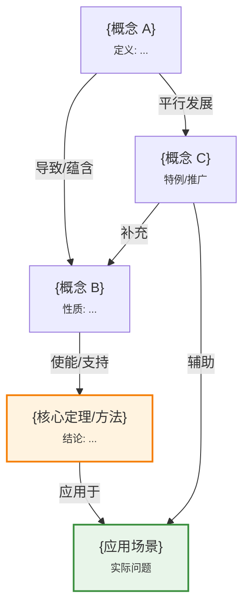

# {section-number} {section-name}

> 📖 本节 Deep Dive | 预计学习时间: {X} 分钟

---

## 1. 背景与动机

### 1.1 历史背景

**学科演进脉络**

{该内容在学科历史发展中的位置，以及它是如何被提出和发展的。包括关键人物、关键时间点、以及它解决了什么历史性问题。}

**里程碑事件**:

| 年份 | 人物/事件 | 贡献 | 影响 |
|------|-----------|------|------|
| {年份} | {人物} | {具体贡献} | {对领域的影响} |
| {年份} | {事件} | {具体内容} | {后续发展} |

**演进动机**:
- 早期方法: {早期是如何处理这类问题的}
- 局限性: {早期方法存在什么问题}
- 突破: {本节内容带来了什么突破}

### 1.2 研究动机

**为什么研究者关注这个主题？**

{从学术角度阐述该主题的重要性：}

1. **理论意义**: {对理论体系建设的贡献}
2. **方法创新**: {相对于现有方法的创新点}
3. **问题解决**: {能够解决什么关键问题}

**与其他领域的关系**:
- {与领域A的关系}
- {与领域B的交叉应用}

### 1.3 实际应用场景

{本节内容在实际中的重要应用场景。使用表格列出不同场景。}

| 应用领域 | 具体问题 | 本节理论的作用 | 预期效果 |
|----------|----------|----------------|----------|
| {领域1} | {问题描述} | {如何应用} | {效果} |
| {领域2} | {问题描述} | {如何应用} | {效果} |
| {领域3} | {问题描述} | {如何应用} | {效果} |

**典型案例预览**:
> {一个简短但具体的案例预告，让读者知道学完能做什么}

### 1.4 先决条件

**学习本节需要的前置知识**:

| 知识项 | 来源 | 掌握程度要求 | 关键概念 |
|--------|------|:------------:|----------|
| {知识1} | 第{X}章第{Y}节 | 必须熟练掌握 | {概念} |
| {知识2} | 本节之前 | 理解即可 | {概念} |
| {知识3} | 数学基础 | 了解 | {概念} |

**前置检查清单**:
- [ ] 能够复述 {前置概念1} 的定义
- [ ] 能够推导 {前置公式}
- [ ] 理解 {前置定理} 的条件和结论

**如果前置知识不足**: [回到第{X}章复习 →](链接)

---

## 2. 知识逻辑图谱

### 2.1 概念关系图



### 2.2 知识发展依赖链

```
【基础层】           【发展层】              【高潮层】             【应用层】
    ↓                   ↓                     ↓                   ↓
┌─────────┐      ┌─────────────┐       ┌───────────┐      ┌──────────┐
│ {基础}  │ ──→  │ {中间概念}  │  ──→  │ {核心定理}│ ──→  │ {应用}   │
│         │      │             │       │           │      │          │
│ 定义、  │      │ 性质、      │       │ 证明、    │      │ 实例、   │
│ 公理    │      │ 引理        │       │ 结论      │      │ 拓展     │
└─────────┘      └─────────────┘       └───────────┘      └──────────┘
     │                   │                   │                │
     └───────────────────┴───────────────────┴────────────────┘
                         知识演进脉络
```

**依赖链详解**:
1. **基础**: {本节的出发点，最基本概念}
2. **发展**: {如何从基础逐步构建到核心}
3. **高潮**: {本节的核心成果是什么}
4. **应用**: {如何应用到实际问题}

### 2.3 本节在章节中的位置

```
第 {n} 章: {章节标题}
├── {n}.1 {前一节标题} ← 前置知识
│   └── [核心概念: {概念}]
│
├── {n}.2 {本节标题} ← ⭐ 当前位置
│   ├── [核心概念: {概念}]
│   ├── [核心定理: {定理}]
│   └── [应用: {应用}]
│
└── {n}.3 {后一节标题} ← 后续发展
    └── [将本节扩展至: {扩展内容}]
```

**衔接说明**:
- **从前一节继承**: {前一节为本节提供了什么}
- **为后一节铺垫**: {本节为后续内容奠定了什么基础}

---

## 3. 核心概念与数学分析

### 3.1 核心术语定义

**定义 {n}.{m}** ({中文名称} / {English Term}):

> **正式定义**: {使用精确的数学语言给出定义}

**定义详解**:
- **直观解释**: {用通俗语言解释这个概念是什么}
- **数学表述**: $$\text{LaTeX 数学表达}$$
- **为什么这样定义**: {解释定义背后的动机}
- **等价形式**: {如果有等价定义，在此列出}

**定义中的关键要素**:
| 要素 | 符号 | 含义 | 约束条件 |
|------|------|------|----------|
| {要素1} | {$...$} | {含义} | {约束} |
| {要素2} | {$...$} | {含义} | {约束} |

**示例**: {一个具体的简单例子帮助理解定义}

**反例**: {一个不满足定义的简单例子，说明边界}

---

**定义 {n}.{m+1}** ({中文名称} / {English Term}):

> **正式定义**: {定义内容}

{同上结构的详细解释}

### 3.2 符号系统与约定

**本节符号总表**:

| 符号 | 含义 | 数学表达 | 备注 |
|:----:|------|----------|------|
| {$x$} | {含义} | {$x \in \mathcal{X}$} | {说明} |
| {$f(x)$} | {含义} | {$f: \mathcal{X} \to \mathbb{R}$} | {说明} |
| {$\mathcal{D}$} | {含义} | {数据集} | {说明} |

**符号使用约定**:
- {约定1: 如粗体表示向量，花体表示集合}
- {约定2: 如大写表示随机变量，小写表示观测值}

### 3.3 关键公式与性质

#### 公式 1: {公式名称}

**数学表述**:
$$\text{此处为 LaTeX 公式}$$

**公式要素解析**:

| 维度 | 内容 |
|------|------|
| **直观解释** | {这公式在直观上意味着什么，用自然语言描述} |
| **几何意义** | {如果有几何解释，在此描述。如: 这表示曲线下的面积、向量的投影等} |
| **领域背景** | {为什么这个公式在该领域很重要，谁发现的，解决了什么问题} |

**使用条件**: {这个公式在什么条件下成立}

**代数推导**： {如何从定义或其他公式推导而来}

**特殊情况**: {边界情况或退化情况}

**与其他公式的关系**: {引用本节或前面章节的相关公式}


---

#### 公式 2: {公式名称}

{同上结构的详细解析}

### 3.4 重要性质与推论

**性质 {n}.{m}** ({性质名称}):

> **陈述**: {性质的正式陈述}

**证明概要**: {简要证明思路，详细证明见相关定理}

**直观理解**: {为什么这个性质成立}

**重要性**: {这个性质在后续内容中的作用}

**应用提示**: {什么时候会用到这个性质}

---

## 4. 定理与证明

### 4.1 定理陈述

**定理 {n}.{m}** ({定理名称} / {Theorem Name}):

> **正式陈述**: {用精确的数学语言陈述定理}

**定理解读**:
- **条件（前提）**:
  1. **条件 1**: {具体条件及解释}
  2. **条件 2**: {具体条件及解释}
  3. **条件 3**: {具体条件及解释}

- **结论**: {定理的结论及数学表达}
  $$\text{LaTeX 表达结论}$$

- **定理意义**: {这个定理告诉我们什么，为什么重要}

**定理的适用范围**: {在什么情况下适用，什么情况下不适用}

**定理的强度**: {这是一个强结论还是弱结论，能否进一步加强}

**历史背景**: {谁证明了这一定理，什么时候，在什么背景下}

### 4.2 证明详解

**证明策略概览**:

{在开始详细证明前，先用几句话概括证明的整体思路}

**核心思路**: {使用什么技术/方法，如"构造法"、"反证法"、"归纳法"等}

**关键步骤预览**:
1. {步骤1的概括}
2. {步骤2的概括}
3. {步骤3的概括}

---

**正式证明**:

**步骤 1**: {步骤标题}

{数学推导或逻辑推理}

$$
\text{LaTeX 数学推导}
$$

> 💡 **技术注释**: {解释这一步背后的直觉，为什么要这样做，这样做的好处是什么}

> 📝 **细节说明**: {如果这步有细节需要注意，在此说明}

---

**步骤 2**: {步骤标题}

{数学推导或逻辑推理}

$$
\text{LaTeX 数学推导}
$$

> 💡 **技术注释**: {解释这一步背后的直觉}

---

**步骤 n**: {步骤标题} [最终结论]

{最终推导，得出结论}

$$
\text{最终数学表达式}
$$

因此，定理得证。

$$\blacksquare \text{ (证毕)}$$

### 4.3 证明分析与提炼

**核心洞见** (2-3 句话捕捉证明的主要思想):

{用最简洁的语言概括证明的精髓，这是证明中最关键的洞察}

**证明技巧总结**:

| 技巧 | 在本证明中的应用 | 可迁移性 | 其他应用场景 |
|------|------------------|----------|--------------|
| {技巧1} | {如何使用} | ⭐⭐⭐⭐⭐ | {其他定理} |
| {技巧2} | {如何使用} | ⭐⭐⭐⭐ | {其他定理} |

**证明中的关键难点**: {证明中最困难的部分是什么，如何克服}

**如果修改条件**: {如果改变某个条件，证明会怎样，结论还成立吗}

### 4.4 定理间的联系

**与本节其他定理的关系**:

```mermaid
graph LR
    A[引理{n}.1] --> B[定理{n}.{m}]
    C[定理{n}.{m-1}] --> B
    B --> D[推论{n}.1]
    B --> E[定理{n}.{m+1}]
    
    style B fill:#fff3e0
```

**在全书中的地位**: {这一定理在整本书中的重要性}

---

## 5. 具体示例与详解

### 5.1 典型数值示例

**示例 {n}.{m}**: {描述性标题}

**📋 问题陈述**:

{清晰陈述的问题，包括所有给定参数和条件}

**已知**:
- {条件1}
- {条件2}
- {条件3}

**求解**: {明确要求}

---

**🔍 解答过程**:

**步骤 1: 分析问题**

{识别问题类型，确定适用的理论}

**步骤 2: 应用理论**

{将本节理论应用于问题}

带有详细计算的逐步推导:

$$
\begin{aligned}
& \text{代入已知条件: } ... \\
& \text{应用公式: } ... \\
& = ... \quad \text{(中间计算)} \\
& = ... \quad \text{(化简)} \\
& = ... \quad \text{(最终结果)}
\end{aligned}
$$

**步骤 3: 结果解释**

{解释结果的含义，它告诉我们什么}

---

**✅ 验证与检验**:

**正确性检查**:
- [ ] 结果满足所有给定条件
- [ ] 单位/量纲正确
- [ ] 与直觉/预期一致
- [ ] 极端情况合理

**数值验证**:
```
手工计算: {手工计算结果}
程序验证: {程序计算结果}
一致性: ✓ 匹配 / ✗ 不匹配
```

**结果的意义**: {这个结果在实际中意味着什么}

---

### 5.2 概念辨析示例

**示例 {n}.{m+1}**: {概念辨析/边界情况示例}

{专门用来说明概念边界或特殊情况的小例子}

**场景**: {描述场景}

**分析**: {详细分析为什么是这样}

**教训**: {从这个例子中学到了什么}

### 5.3 类比与可视化

**直觉类比**:

{将抽象概念与日常生活经验类比}

| 抽象概念 | 日常类比 | 对应关系 |
|----------|----------|----------|
| {概念A} | {类比A} | {对应点} |
| {概念B} | {类比B} | {对应点} |

**局限性**: {这个类比的局限在哪里，什么时候会失效}

**可视化** (如适用):

{用文字描述图像，或插入图像引用}

```
[概念可视化描述]

        轴1
         ↑
         |    ╱
         |   ╱  概念区域
         |  ╱
         | ╱
         +────────→ 轴2
```

---

## 6. 深入理解与拓展

### 6.1 一句话本质

> 🎯 **核心要点**: {用最精炼的一句话概括本节的关键思想/方法/结论}

### 6.2 深入思考问题

{帮助深入理解本节内容的思考性问题}

1. **概念层面**: {关于概念本质的问题}
   <!-- 思考方向: {提示} -->

2. **方法层面**: {关于方法选择的问题}
   <!-- 思考方向: {提示} -->

3. **应用层面**: {关于实际应用的问题}
   <!-- 思考方向: {提示} -->

4. **拓展层面**: {关于向更一般情况拓展的问题}
   <!-- 思考方向: {提示} -->

### 6.3 与其他节的关系

**本节输出**:
- {输出1: 可以直接用于什么}
- {输出2: 为后续内容提供了什么}

**后续发展预告**: {在后续章节中，本节内容将如何被扩展/深化}

---

## 7. 总结与反思

### 7.1 关键要点总结

本节必须掌握的 **{N}** 个核心要点:

1. **{要点 1 标题}**: {详细说明，包含必要的公式或结论}
   
   💡 *记忆技巧*: {如何记住这个要点}

2. **{要点 2 标题}**: {详细说明}
   
   💡 *记忆技巧*: {如何记住这个要点}

3. **{要点 3 标题}**: {详细说明}

4. **{要点 4 标题}**: {详细说明}

5. **{要点 5 标题}**: {详细说明}

### 7.2 本节知识框架

```
┌─────────────────────────────────────────────────────────────┐
│  第{n}.{m}节: {节标题}                                      │
├─────────────────────────────────────────────────────────────┤
│  输入/前置                                                   │
│  • {前置1}                                                  │
│  • {前置2}                                                  │
│                                                             │
│  处理/核心                                                   │
│  • {核心概念/方法}                                          │
│  • {关键定理}                                               │
│  ↓                                                          │
│  输出/结果                                                   │
│  • {结果1}                                                  │
│  • {结果2}                                                  │
│                                                             │
│  应用/价值                                                   │
│  • {应用场景}                                               │
└─────────────────────────────────────────────────────────────┘
```

### 7.3 常见误解与纠正

| 常见误解 ❌ | 正确理解 ✅ | 为什么容易错 | 如何避免 |
|-------------|-------------|--------------|----------|
| ❌ {错误想法1} | ✅ {正确理解1} | {原因} | {方法} |
| ❌ {错误想法2} | ✅ {正确理解2} | {原因} | {方法} |
| ❌ {错误想法3} | ✅ {正确理解3} | {原因} | {方法} |

### 7.4 反思问题

**连接性问题** (与本章其他节):
1. {连接到前一节的问题}?
2. {连接到下一节的问题}?

**应用性问题**:
1. {关于实际应用的问题}?
2. {如果条件改变会怎样}?

**批判性问题**:
1. {这个方法的局限性是什么}?
2. {在什么情况下应该使用替代方法}?

### 7.5 学习检查清单

- [ ] 能够复述 {核心概念} 的定义
- [ ] 能够独立推导 {关键公式}
- [ ] 能够复述 {定理n.m} 的证明思路
- [ ] 能够解决类似 {示例n.m} 的问题
- [ ] 能够辨析 {相关概念} 的区别
- [ ] 知道 {方法} 的适用条件
- [ ] 了解 {理论} 的应用场景

---

## 附录

### A. 公式速查表

| 公式 | 名称 | 使用条件 | 备注 |
|:----:|------|----------|------|
| $$...$$ | {名称} | {条件} | {说明} |
| $...$ | {名称} | {条件} | {说明} |

### B. 术语索引

| 术语 | 英文 | 定义 | 页码/位置 |
|------|------|------|:---------:|
| {术语} | {English} | {定义} | {位置} |

### C. 延伸阅读

**理论深化**:
- {论文/书籍}: {简介及阅读建议}

**应用拓展**:
- {案例/项目}: {简介及实践建议}

**补充材料**:
- {视频/教程}: {资源链接}

---

> 📌 **下一节**: [第{n}.{m+1}节 {标题}]({n}.{m+1}_{标题}.md)
> 
> 📚 **返回概览**: [第{n}章概览](../00_概览.md)
